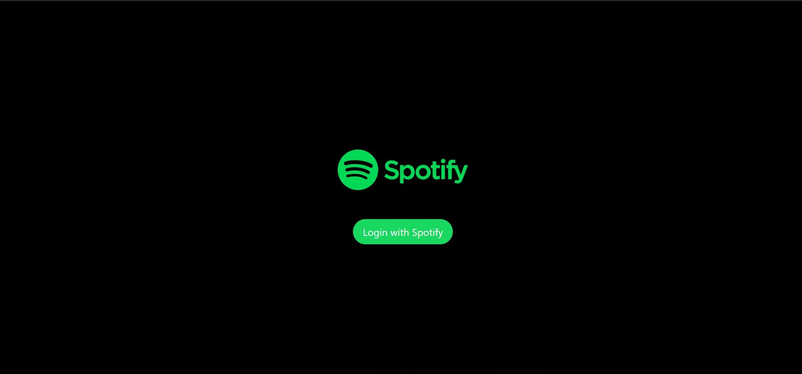
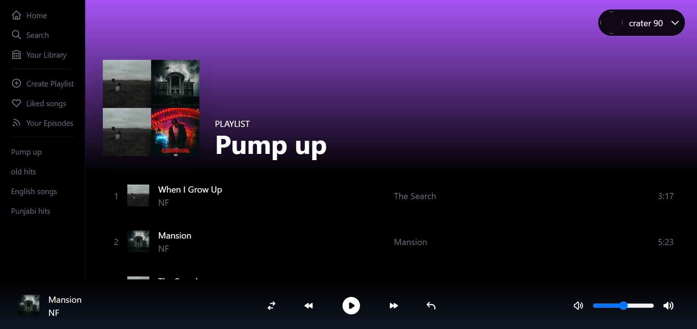
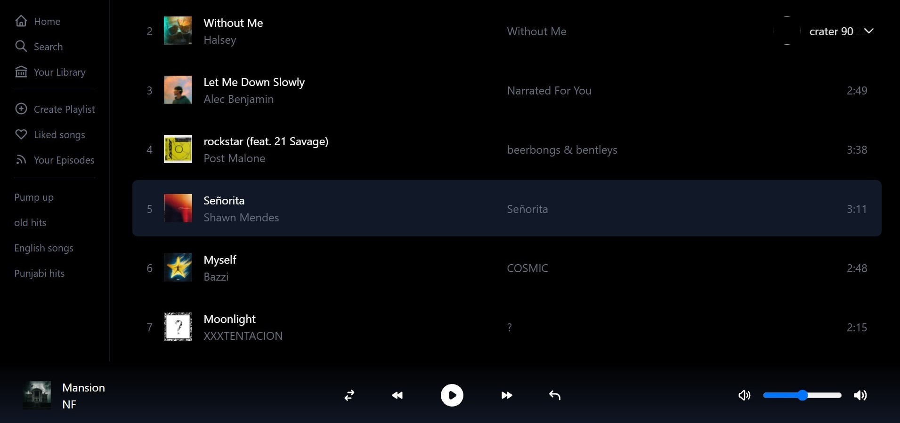

# Spotify clone 

Demo: https://spotify-build-rose.vercel.app

This is a spotify clone built with Nextjs, Spotify-web-api-node and Tailwindcss.

### Features

- Does the user Login with Spotify Authentication using NextAuth.
- Gets the logged in user data such as user's playlists, recently played, etc from spotify-web-api-node.
- Plays and pause the songs using api calls.
- also controls volume using debouncing concepts.

### Running project locally 

- Install dependencies: run `npm install` in the root project
- Run project: `npm run dev`
- make sure to have an active spotify account with some playlists to play around ❤️.